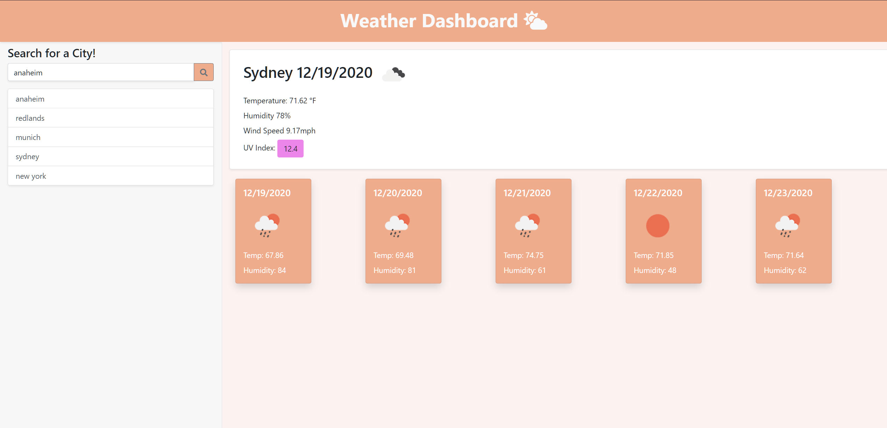

#### Developer: C.T. Bell

# Weather Dashboard

Your personal weather headquarters.

## How it works:

Enter the name of a city in the search field and click "enter" or click the search icon to see weather.

Click on Cities in earch history to quickly switch back and forth.

# Link to Live Site

[Live Site](https://charlestbell.github.io/Weather-Dashboard/)

# Features

- Current weather
- 5 Day forcast
- Keeps track of search history for easy comparison
- Automatically displays the last city you searched upon return visits
- Weather data is hidden until after the search is completed.

## Upcoming Features

- Save search history to local storage
- Button to clear search history
- Validation that each search is a real city
- Mobile Responsiveness

## Screenshot

